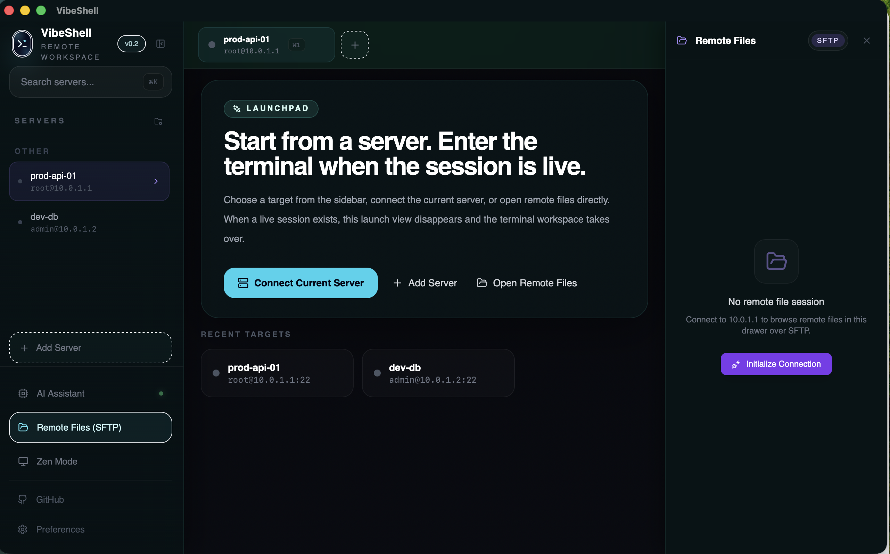
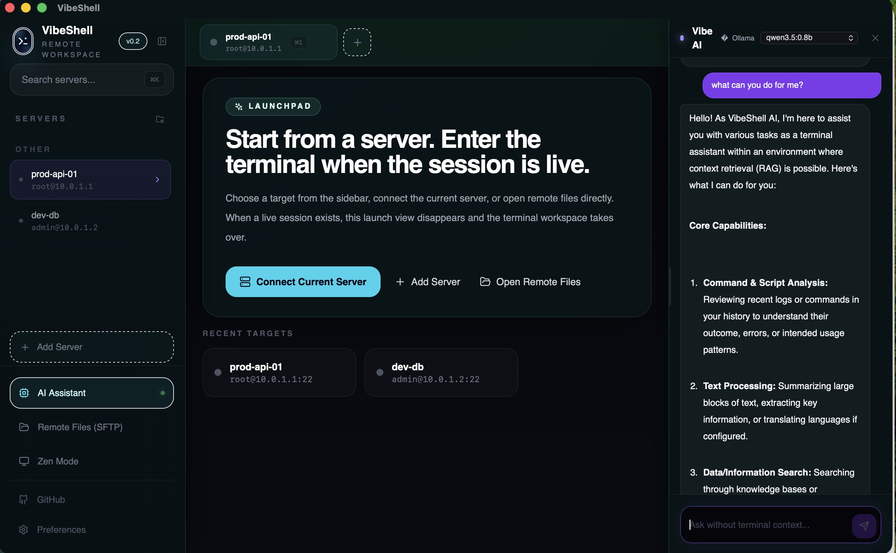
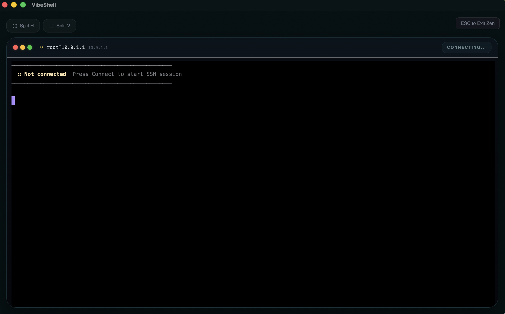

# VibeShell

> AI-native remote workspace for SSH and SFTP.  
> **Status:** Beta `v0.2.0`

VibeShell is a desktop app built with `Tauri 2 + Rust + React` for people who live in terminals but want stronger context, safer remote workflows, and an AI assistant that feels native instead of bolted on.





It combines:

- multi-session terminal workflows
- secure SSH/SFTP access
- local-first AI with Ollama support
- workspace persistence
- a focused dark UI designed for day-to-day remote operations

## What `v0.2` includes

- Native desktop shell powered by `Tauri`
- Multi-session terminal workspace with split panes
- SSH sessions with resize and streaming I/O
- SFTP drawer for remote file browsing and editing
- AI side panel with Markdown rendering, resizable width, and local Ollama integration
- Sidebar with collapsible navigation, Zen mode, GitHub link, and app preferences
- Theme, language, and terminal font preferences with persistence
- Secure credential storage and SSH host trust workflow
- Workspace/session persistence and server grouping

## Product direction

VibeShell is currently optimized around:

- `SSH` for terminal work
- `SFTP` for remote files
- `Ollama` as the best local AI path

`FTP` support still exists in backend code paths, but it is no longer part of the main UI flow in `v0.2`. The current product direction is to keep the core experience opinionated and reliable around `22`-port remote workflows.

## Tech stack

- Frontend: `React 18`, `TypeScript`, `Vite`, `Tailwind CSS`, `Framer Motion`, `i18next`
- Terminal: `xterm.js` with fit + WebGL addons
- Desktop runtime: `Tauri 2`
- Backend: `Rust`, `Tokio`
- SSH/SFTP: `russh`, `russh-sftp`
- Secure storage: OS keychain via `keyring`
- AI: local Ollama plus configurable cloud provider profiles

## Repository structure

- `src/`
  - frontend application
  - UI composition, state orchestration, AI drawer, terminal grid, settings, i18n
- `src-tauri/src/`
  - Rust backend
  - SSH/SFTP/session lifecycle
  - AI provider bridge
  - storage and trust management
- `scripts/`
  - helper scripts such as protocol smoke checks and icon generation

## Development

### Requirements

- `Node.js` 18+
- `Rust` stable toolchain
- Xcode Command Line Tools on macOS
- optional: [Ollama](https://ollama.com/) for local AI

### Install

```bash
npm install
```

### Run

```bash
npm run tauri dev
```

### Build

```bash
npm run build
npm run tauri build
```

### Test

```bash
npm test
cd src-tauri && cargo test
```

## Ollama

VibeShell is designed to work well with local Ollama:

- the app can probe local models
- it can attempt to start Ollama when needed
- model selection uses the locally available model list

If Ollama is not already running, you can still start it manually:

```bash
ollama serve
```

## Protocol smoke check

There is a lightweight smoke test for verifying whether a target host actually exposes the expected remote endpoints before debugging the full UI flow:

```bash
SMOKE_HOST=your-server.example.com \
SMOKE_SSH_PORT=22 \
SMOKE_FTP_PORT=21 \
SMOKE_SFTP_PORT=22 \
npm run smoke:protocols
```

This is mostly useful during development and debugging. For the current product direction, `SSH/SFTP` are the primary paths.

## Current maturity

`v0.2` is no longer a throwaway prototype. The app is usable, the build is healthy, and the core architecture is in place.

That said, it is still in active refinement:

- SSH/SFTP real-world stability should keep improving
- the AI workflow and context handling will continue to get stronger
- visual polish is still being iterated

## GitHub

Project repository: [ToBeWin/VibeShell](https://github.com/ToBeWin/VibeShell)
